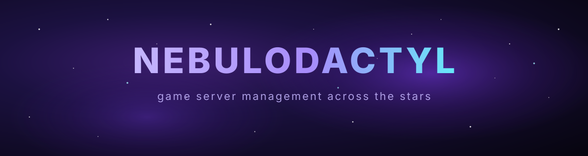
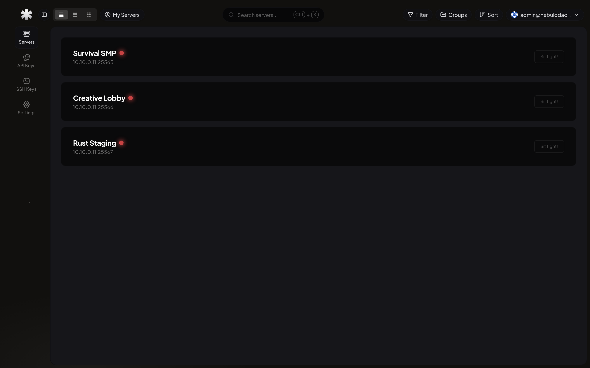

<p align="center">
  
</p>

<br/>

<h1 align="center">Nebulodactyl</h1>

<p align="center">
  <a href="https://github.com/Sudo-Ivan/Nebulodactyl/actions/workflows/ci.yaml">
    
  </a>
  
  
</p>

<br/>

Nebulodactyl is a game server management panel forked from Hydrodactyl (itself a Pterodactyl fork) with a dark interface and support for joining nodes over a [Nebula](https://github.com/slackhq/nebula) overlay network.



## Features

- Dark theme: a monochrome color scheme with a subtle starfield and ambient glow.
- Nebula overlay network: the panel signs node certificates and routes daemon traffic over a mutually authenticated Nebula mesh. Nodes enroll themselves with the `nebulod` agent in `agent/`. See `config/nebula.php`, `agent/`, `examples/nebula/`, and `docs/networking.md`.
- Private network friendly: works on a LAN, behind a VPN, or over the Nebula overlay. Panel-to-node traffic does not need public addresses. See `docs/networking.md`.
- Reverse proxy friendly: works behind Coolify, Traefik, nginx, or Caddy with `TRUSTED_PROXIES` and a `/healthz` endpoint. See `examples/coolify/`.
- Reimagined client panel for console, files, databases, backups, network, users, startup, schedules, activity, and software.
- Marketplace: a native plugin and mod installer for Minecraft servers backed by Modrinth, Hangar, and Spiget.
- Setup wizard for guided first-run configuration.
- Logo customization from the admin dashboard.
- S3-compatible backups with per-node storage on any S3-compatible provider.
- MySQL, MariaDB, PostgreSQL, or SQLite for the panel database.
- OpenAPI documentation powered by Scalar.
- Laravel 13, React 19, TypeScript, and Tailwind CSS, formatted and linted with Biome.

> [!WARNING]
> **Pre-release Software:** Nebulodactyl is currently under active development. Some UI elements may appear broken and bugs may exist.
>
> **Incompatibility Notice:** Nebulodactyl is an all-in-one panel and is **not compatible** with Blueprint framework extensions.

> [!NOTE]
> Nebulodactyl inherits its documentation from upstream. Please review the Hydrodactyl documentation at [hydrodactyl.dev](https://hydrodactyl.dev/docs/hydrodactyl) before installing.

## Quick start

Requires Docker with the Compose plugin:

```bash
curl -fsSL https://raw.githubusercontent.com/Sudo-Ivan/Nebulodactyl/master/install.sh | bash
```

Or manually:

```bash
git clone https://github.com/Sudo-Ivan/Nebulodactyl.git
cd Nebulodactyl
cp docker-compose.example.yml docker-compose.yml
cp .env.example .env   # set APP_URL, DB_PASSWORD, DB_ROOT_PASSWORD
docker compose up -d
```

On first boot the container prints a setup link (`/setup?key=...`, valid for
one hour) to its logs. Open it to create the admin account in the browser.
If the link expires, mint a new one with
`docker compose exec panel php artisan p:setup:link`, or skip the UI entirely
with `docker compose exec panel php artisan p:user:make`.

See the upstream [Installation Guide](https://hydrodactyl.dev/docs/hydrodactyl/installation) and [Local Development Guide](https://hydrodactyl.dev/docs/hydrodactyl/local-development) for detailed instructions.

> [!NOTE]
> Windows is supported for **local development only**.

## License

Nebulodactyl is open-source software licensed under the **Apache License 2.0**.

You are free to use, modify, and redistribute Nebulodactyl under the terms of the license. A copy of the full license text is available in the [LICENSE](./LICENSE.md) file included in this repository.

### Copyright & Attribution

Nebulodactyl is built upon the work of previous open-source projects and their contributors:

- **Pterodactyl®**: Copyright © 2015-2022 Dane Everitt and contributors.
- **Pyrodactyl™**: Copyright © 2023-2025 Pyro Inc. and contributors.
- **Pyrodactyl™**: Copyright © 2025-2026 Pyrodactyl-oss and contributors.
- **Hydrodactyl**: Copyright © 2026-present Naterfute, Blueprint Framework, and contributors.
- **Nebulodactyl**: Copyright © 2026-present Ivan and contributors.

All original copyright notices, license notices, and attributions must remain intact when redistributing this software.

Unless explicitly stated otherwise, all source code within this repository is licensed under the **Apache License 2.0**.

## Support

- **Star the repository**: Share it with others to help more people discover Nebulodactyl.
- [GitHub Issues](https://github.com/Sudo-Ivan/Nebulodactyl/issues): Report bugs and request features.
